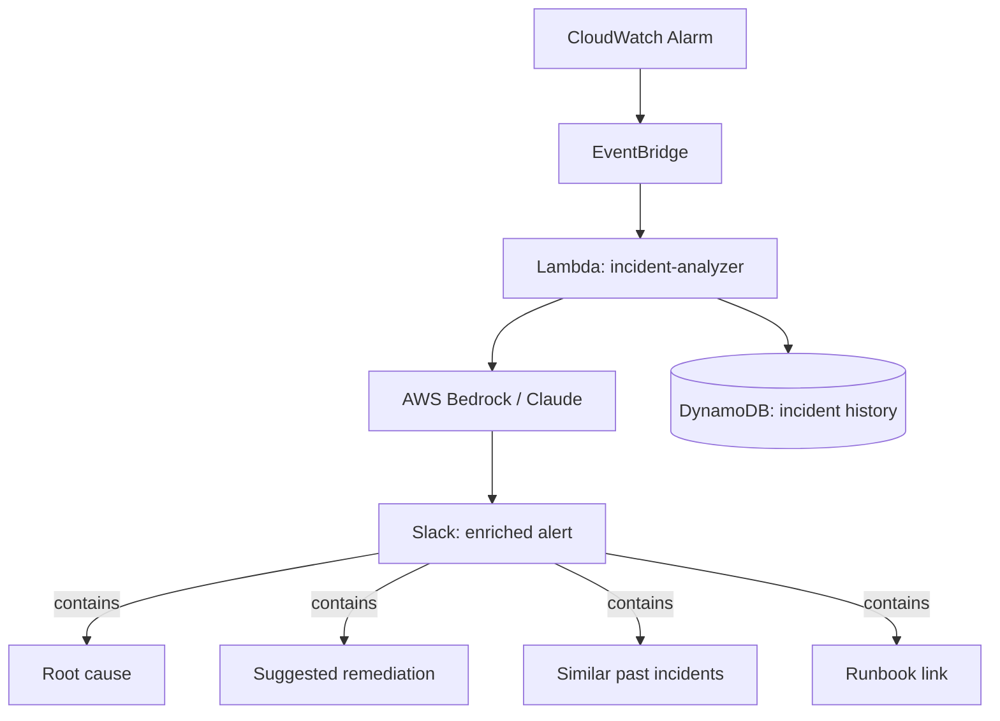

```markdown
# 🤖 devops-ai-tools

> AI-powered tools for DevOps engineers — Claude, Bedrock, MCP servers.

[]()
[](LICENSE)

## 🎯 Vision

DevOps + AI = faster decisions at scale.
This toolkit collects reusable AI agents and utilities built during my
Dev → DevOps reconversion journey.

> Not "AI replaces DevOps" — rather "DevOps engineers who leverage AI
> outperform those who don't."

## 🛠️ Tools

| Tool | Purpose | Status |
|------|---------|--------|
| `terraform-reviewer` | Audit Terraform files for anti-patterns via Claude | 🔜 W5 |
| `iam-policy-reviewer` | Identify overly-permissive IAM policies, generate least-privilege | 🔜 W6 |
| `incident-analyzer` | Lambda triggered by CW alarm → Bedrock root cause analysis → Slack | 🔜 W23 |
| `devops-digest` | AI-curated DevOps newsletter from AWS/K8s/CNCF sources | 🔜 W24 |
| `mcp-aws-ops` | MCP server exposing AWS operations to Claude Desktop/Cursor | 🔜 W25 |

## 🏗️ Architecture (incident-analyzer)



## 📂 Structure (planned)

```
devops-ai-tools/
├── terraform-reviewer/
│   ├── reviewer.py
│   └── README.md
├── iam-policy-reviewer/
│   ├── auditor.py
│   └── README.md
├── incident-analyzer/
│   ├── lambda_handler.py
│   ├── terraform/
│   └── README.md
├── devops-digest/
│   ├── agent.py
│   └── README.md
├── mcp-aws-ops/
│   ├── server.py
│   └── README.md
└── .github/workflows/
```

## 🧪 Tech Stack

- **Python 3.12** — All tools and Lambda functions
- **AWS Bedrock** — Production LLM endpoints (Claude)
- **Anthropic Claude API** — Local development
- **Model Context Protocol (MCP)** — AI tool exposure to Claude/Cursor
- **Boto3** — AWS SDK
- **LocalStack** — Local testing

## 📜 License
